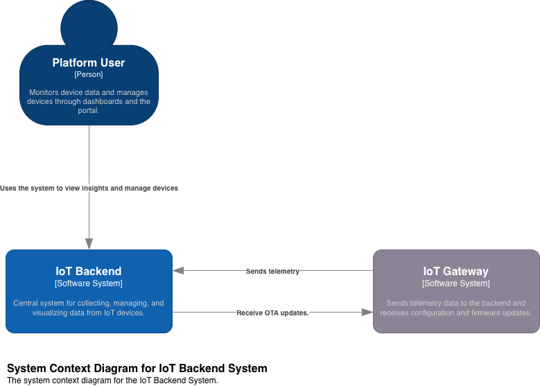
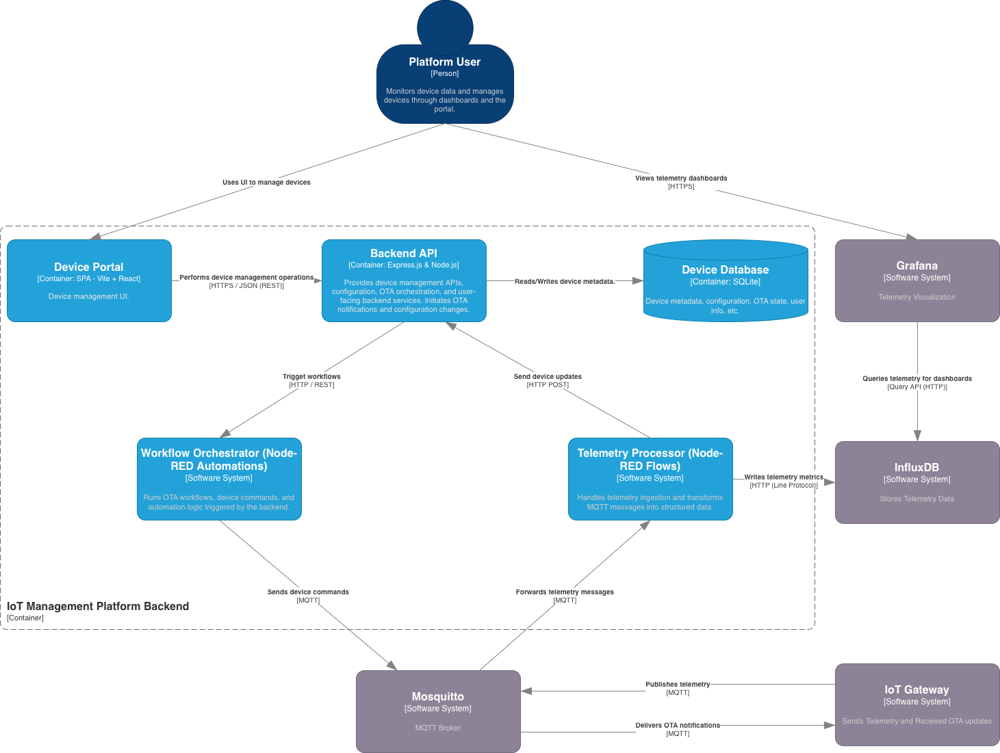

# System Architecture

This document describes the high-level architecture of the IoT Backend System.  
The diagram illustrates the main actors, data flows, and backend services involved in telemetry ingestion, visualization, device management, and orchestration.

## System Context Diagram

**Description**  
The platform consists of three primary actors:

- **Platform User** — interacts with the device portal UI and views dashboards.
- **IoT Gateway** — edge device sending telemetry and receiving commands.
- **IoT Backend** — centralized backend running on a Raspberry Pi, providing OTA updates, storage, orchestration, and data visualization.

## Container View

This view provides a breakdown of the major containers:
- Device Portal (React SPA)
- Backend API (Express)
- Telemetry Processor (Node-RED)
- Workflow Orchestrator (Node-RED)
- SQLite database (device metadata)
- InfluxDB (telemetry storage)
- Mosquitto MQTT broker
- Grafana dashboards

## Related Documents

This document provides the high-level system design.
Detailed specifications are defined in the following documents:

- **Telemetry Data Model & Topic Contract**
  - Defines MQTT topic hierarchy, payload schemas, and delivery semantics.
  - See: `telemetry_model.md`

- **Gateway Identity & Authorization Model**
  - Defines gateway authentication, ACL rules, and trust boundaries.
  - See: `device-identity.md`

- **Runtime Environment**
  - Describes how the system is deployed and operated.
  - See: `runtime.md`