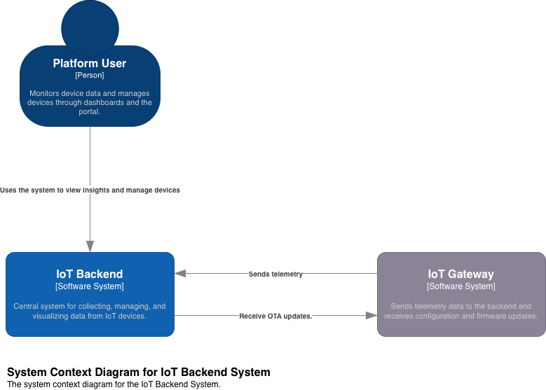
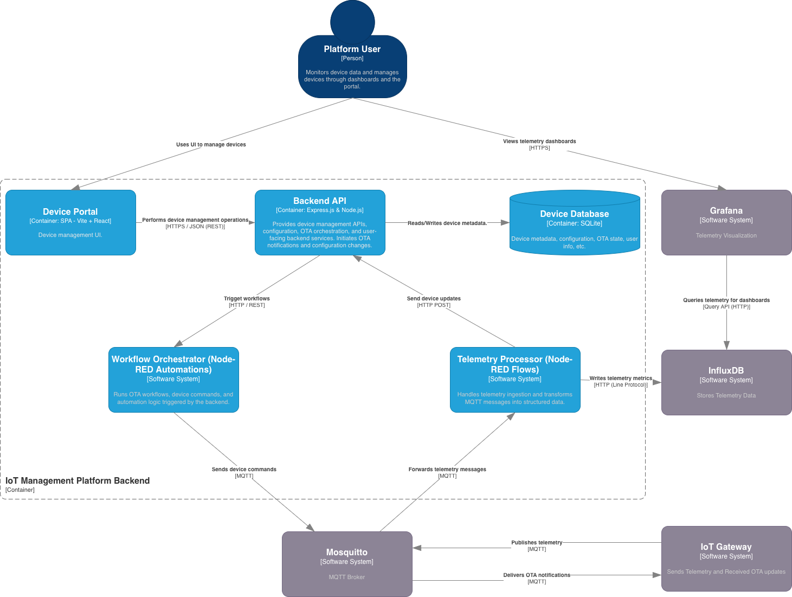

# System Architecture

This document describes the high-level architecture of the IoT Backend System.  
The diagram illustrates the main actors, data flows, and backend services involved in telemetry ingestion, visualization, device management, and orchestration.

## System Context Diagram

**Description**  
The platform consists of three primary actors:

- **Platform User** — interacts with the device portal UI and views dashboards.
- **IoT Gateway** — edge device sending telemetry and receiving commands.
- **IoT Backend** — centralized backend running on a Raspberry Pi, providing OTA updates, storage, orchestration, and data visualization.

## Container View

This view provides a breakdown of the major containers:
- Device Portal (React SPA)
- Backend API (Express)
- Telemetry Processor (Node-RED)
- Workflow Orchestrator (Node-RED)
- SQLite database (device metadata)
- InfluxDB (telemetry storage)
- Mosquitto MQTT broker
- Grafana dashboards

## Deployed Sensor Nodes

| Node | Firmware repo | BLE name | Device ID | Location | Gateway |
|------|--------------|----------|-----------|----------|---------|
| Smart Garden Node | `smart-garden-node/` | `SmartGardenNode` | `garden-node-01` | `inside` | `gw-01` |
| Greenhouse Node | `greenhouse-node/` | `GreenhouseNode` | `greenhouse-node-01` | `greenhouse` | `gw-01` |

Both nodes use the same BLE contract (service `0x180A`, char `0x2A6E`, packed `sensor_data_t`). All nodes communicate exclusively with the gateway over BLE. The gateway holds the MQTT identity and is the only device that speaks to the backend.

To add a new sensor node: see **§8 Adding a New Sensor Node** in `device-identity.md`.

## Related Documents

This document provides the high-level system design.
Detailed specifications are defined in the following documents:

- **Telemetry Data Model & Topic Contract**
  - Defines MQTT topic hierarchy, payload schemas, and delivery semantics.
  - See: `telemetry_model.md`

- **Gateway Identity & Authorization Model**
  - Defines gateway authentication, ACL rules, and trust boundaries.
  - See: `device-identity.md`

- **Runtime Environment**
  - Describes how the system is deployed and operated.
  - See: `runtime.md`